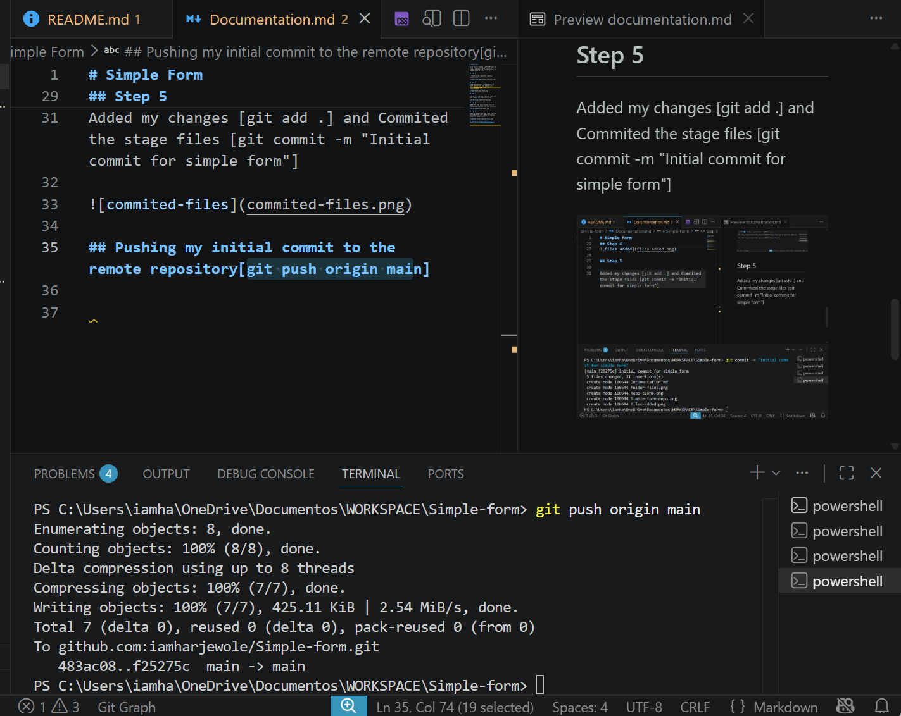
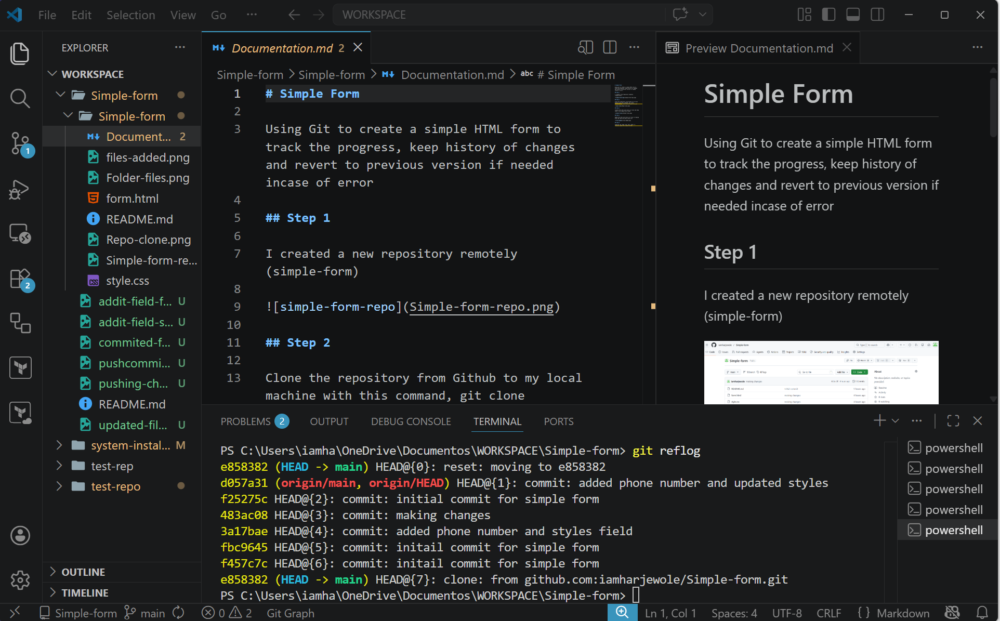
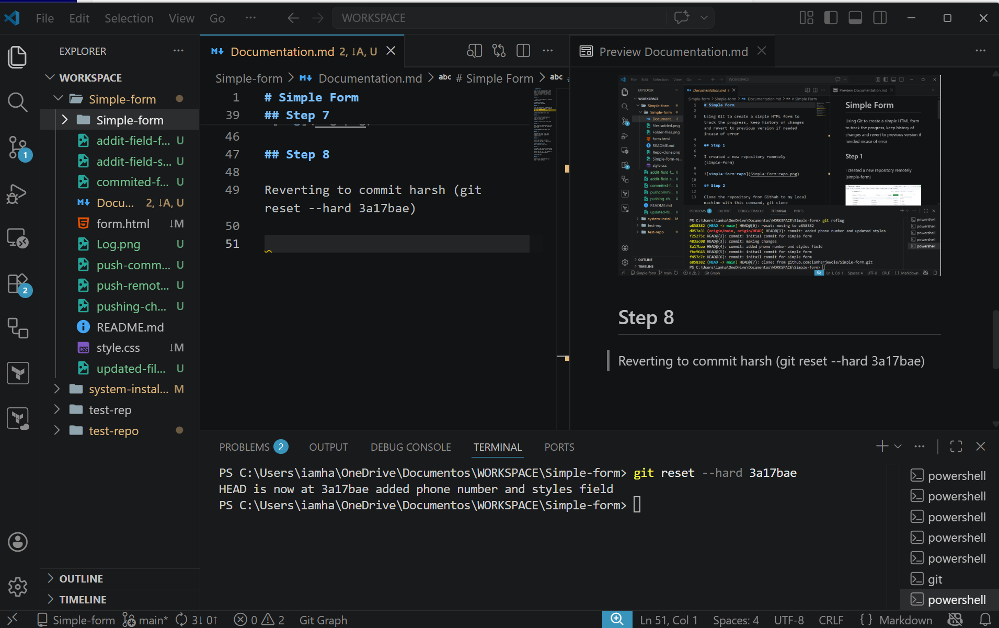
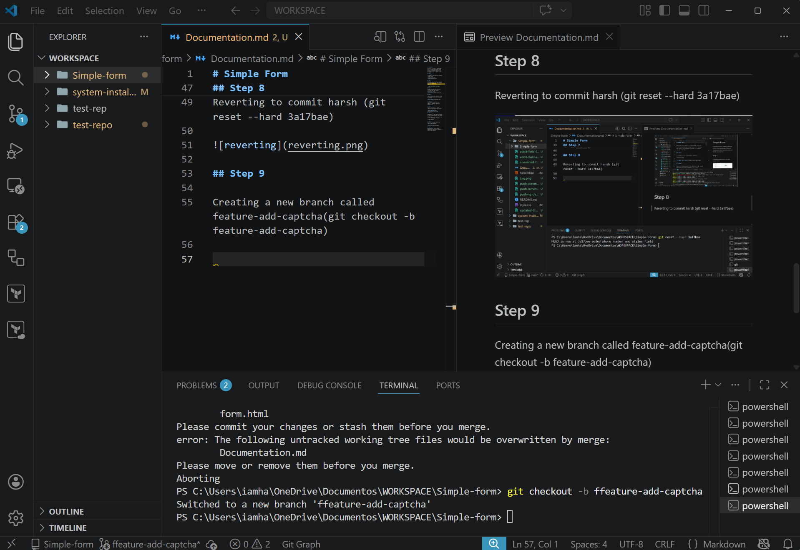
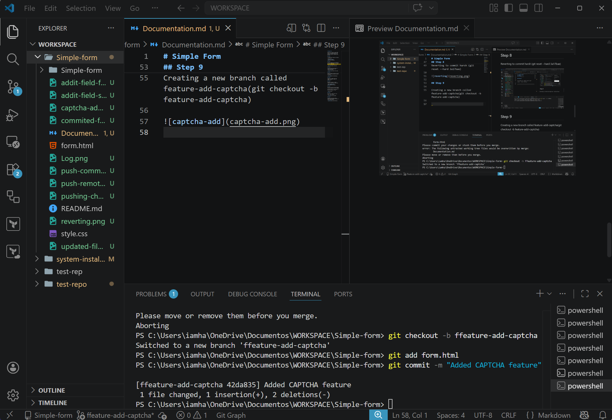
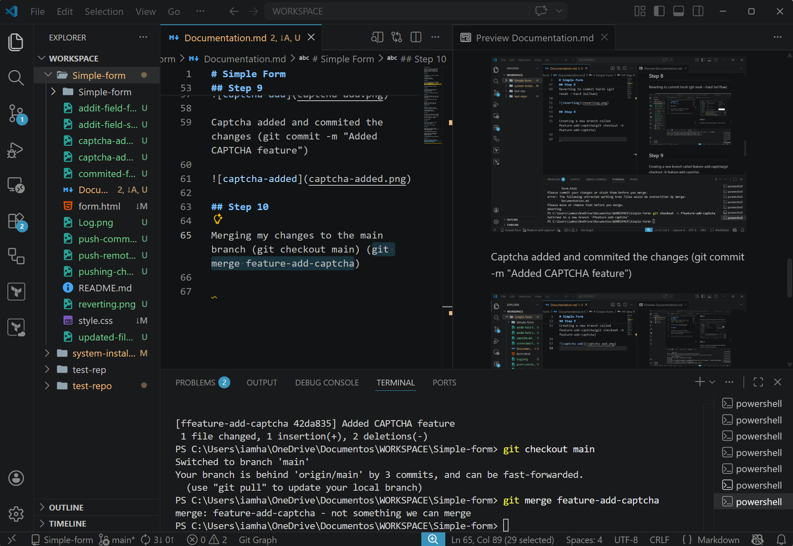

# Simple Form

Using Git to create a simple HTML form to track the progress, keep history of changes and revert to previous version if needed incase of error

## Creating new repository remotely (simple-form)

## Clone the repository from Github to my local machine with this command, git clone [git@github.com:iamharjewole/Simple-form.git](https://github.com/iamharjewole/Simple-form.git)

## Created Form.html and style.css files and keep them in the simple-form folder

## Added form.html and style.css files to staging area (git add form.html style.css)

## Commited the stage files [git commit -m "Initial commit for simple form"]

## Pushing my changes to remote repository [git push origin main]

## Rverting to my last version because of bug introduced by my last change

Getting my Log, so i can revert to my last version(git reflog)

## Reverting to commit harsh (git reset --hard 3a17bae)

## Creating a new branch called feature-add-captcha(git checkout -b feature-add-captcha)

Captcha added and commited the changes (git commit -m "Added CAPTCHA feature")

## Merging my changes to the main branch (git checkout main) then (git merge feature-add-captcha)

## Pushing my updates to the remote repository (git push origin main)
