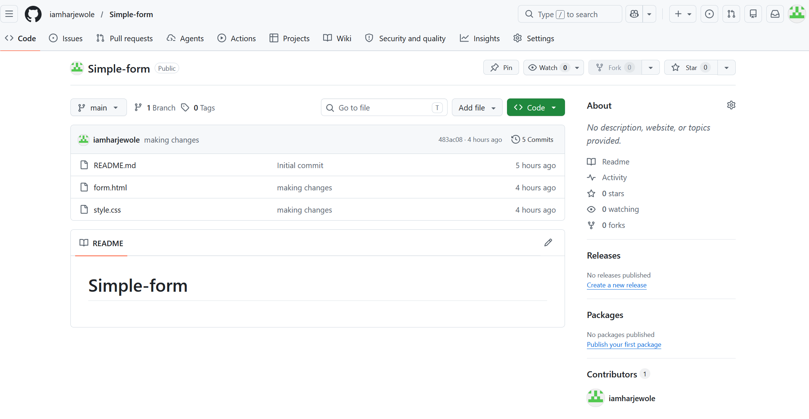
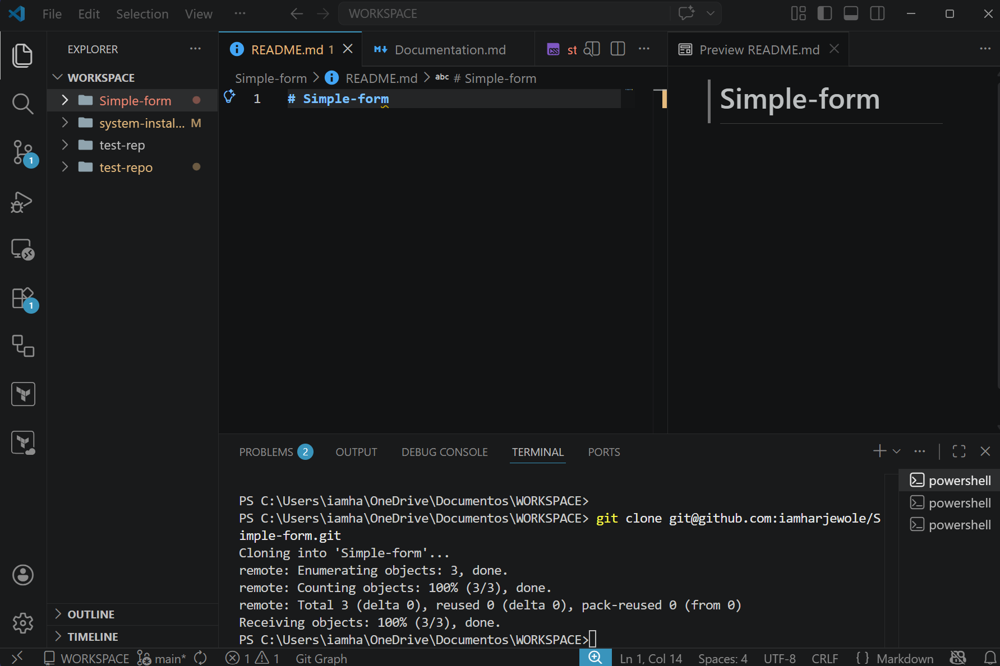
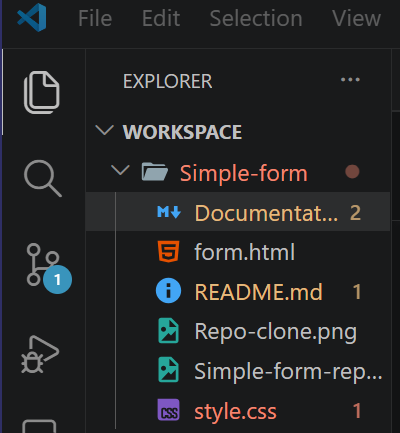
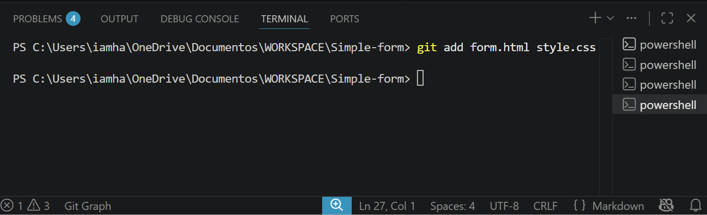

# Simple Form

Using Git to create a simple HTML form to track the progress, keep history of changes and revert to previous version if needed incase of error

## Step 1

I created a new repository remotely (simple-form)

## Step 2

Clone the repository from Github to my local machine with this command, git clone git@github.com:iamharjewole/Simple-form.git

## Step 3

Created Form.html and style.css files and keep them in the simple-form folder.

## Step 4

Added form.html and style.css files to staging area (git add form.html style.css)

## Step 5

Commited the stage files [git commit -m "Initial commit for simple form"]